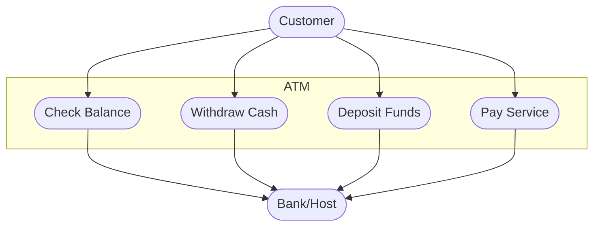
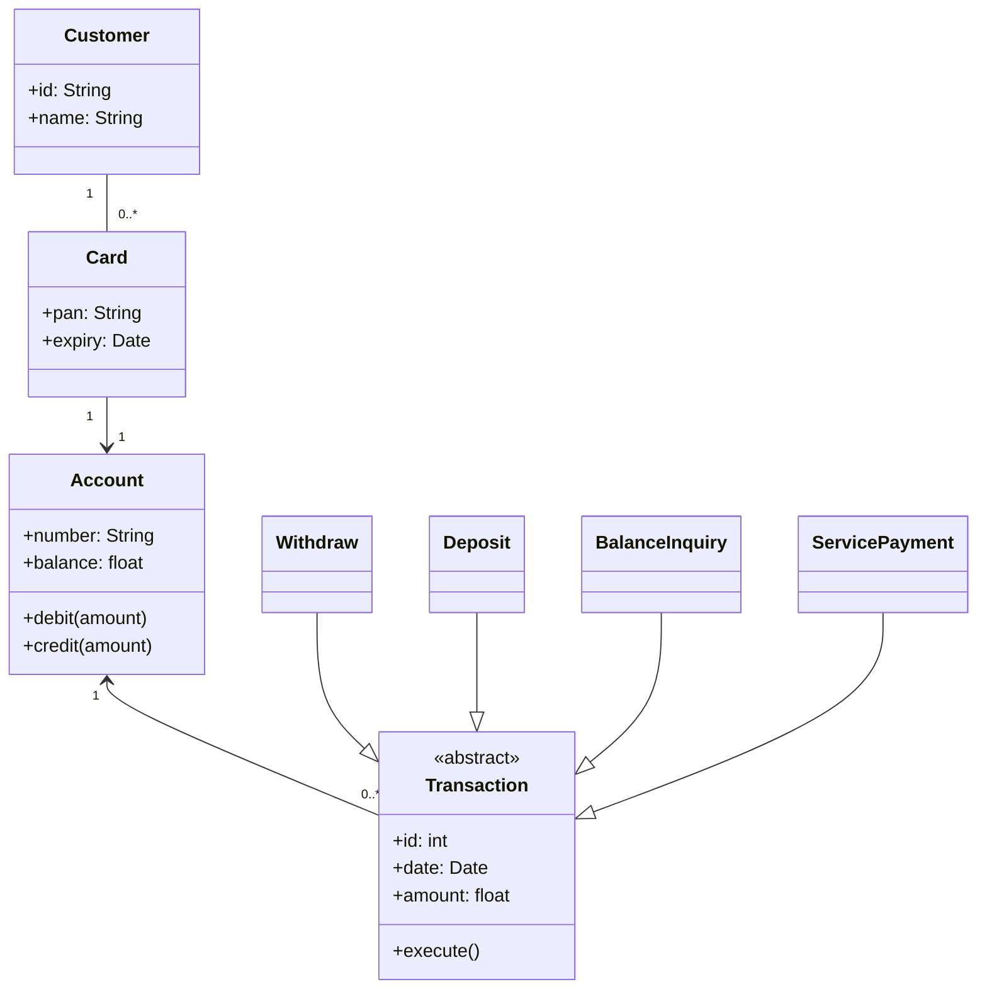
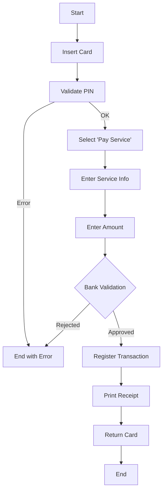
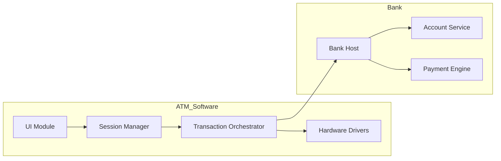
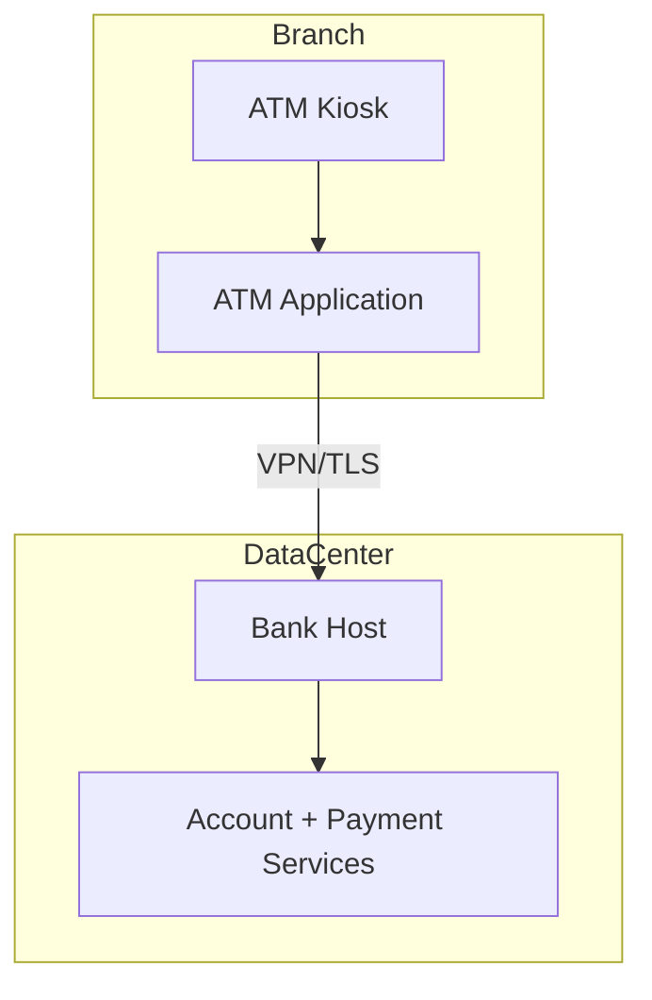

# ATM UML Diagrams (4+1 Views)

## 1. Use Case View

```mermaid
flowchart TB
  actor1([Customer])
  actor2([Bank/Host])
  
  subgraph ATM
    CU1([Check Balance])
    CU2([Withdraw Cash])
    CU3([Deposit Funds])
    CU4([Pay Service])
  end

  actor1 --> CU1
  actor1 --> CU2
  actor1 --> CU3
  actor1 --> CU4
  
  CU1 --> actor2
  CU2 --> actor2
  CU3 --> actor2
  CU4 --> actor2
```

```mermaid
classDiagram
  class Customer {
    +id: String
    +name: String
  }
  class Account {
    +number: String
    +balance: float
    +debit(amount)
    +credit(amount)
  }
  class Card {
    +pan: String
    +expiry: Date
  }
  class Transaction {
    <<abstract>>
    +id: int
    +date: Date
    +amount: float
    +execute()
  }
  class Withdraw
  class Deposit
  class BalanceInquiry
  class ServicePayment

  Customer "1" -- "0..*" Card
  Card "1" --> "1" Account
  Account "1" <-- "0..*" Transaction
  Withdraw --|> Transaction
  Deposit --|> Transaction
  BalanceInquiry --|> Transaction
  ServicePayment --|> Transaction
```

```mermaid
flowchart TD
  A[Start] --> B[Insert Card]
  B --> C[Validate PIN]
  C -->|OK| D[Select 'Pay Service']
  C -->|Error| Z[End with Error]
  D --> E[Enter Service Info]
  E --> F[Enter Amount]
  F --> G{Bank Validation}
  G -->|Approved| H[Register Transaction]
  G -->|Rejected| Z[End with Error]
  H --> I[Print Receipt]
  I --> J[Return Card]
  J --> K[End]
```

```mermaid
flowchart LR
  subgraph ATM_Software
    UI[UI Module]
    Session[Session Manager]
    Tx[Transaction Orchestrator]
    Drivers[Hardware Drivers]
  end
  
  subgraph Bank
    Host[Bank Host]
    Accounts[Account Service]
    Payments[Payment Engine]
  end

  UI --> Session --> Tx
  Tx --> Drivers
  Tx --> Host
  Host --> Accounts
  Host --> Payments
```

```mermaid
flowchart TB
  subgraph Branch
    ATMNode[ATM Kiosk]
    ATMApp[ATM Application]
    ATMNode --> ATMApp
  end

  subgraph DataCenter
    HostSys[Bank Host]
    Services[Account + Payment Services]
  end

  ATMApp -->|VPN/TLS| HostSys
  HostSys --> Services
```
